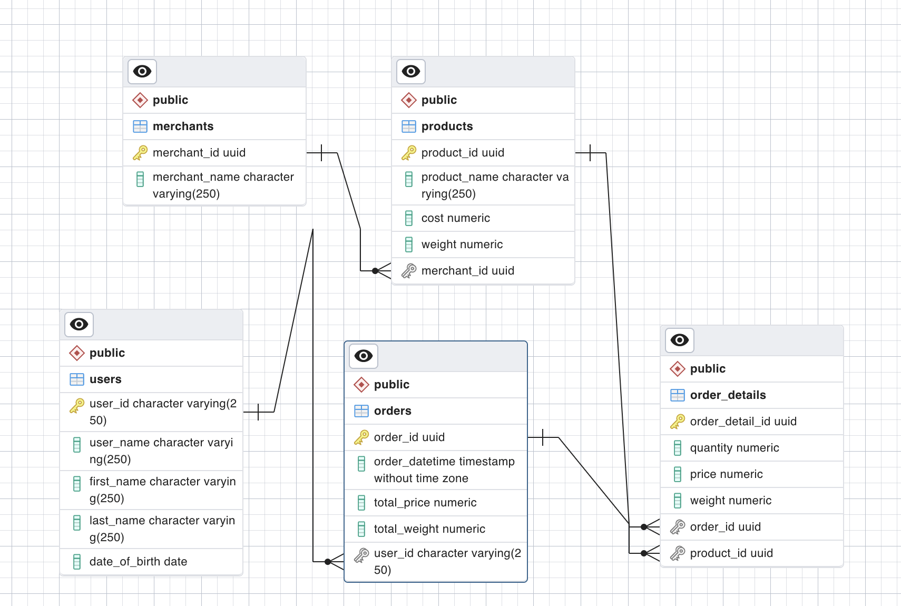

# Senior Data Enginer Tech Challenge
---
## Section2: Databases

You are the tech lead for an e-commerce company that operates on the cloud. The company allows users to sign up as members on their website and make puchases on items listed. You are required to design and implement a pipeline that processes membership applications and determine if an application is successful or unsuccessful. Applications are dropped into a location for processing. Engineers have already written code to determine a successful or unsuccessful application, as well as creating membership IDs for successful applications. You may use the processed datasets from section 1 as reference. Successful applications should be sent to a location for storage and refrence. 

The e-commerce company also requires you to set up a database for their sales transactions. 
Set up a PostgreSQL database using the Docker [image](https://hub.docker.com/_/postgres) provided. We expect at least a Dockerfile which will stand up your database with the DDL statements to create the necessary tables.vYou are required to produce  entity-relationship diagrams as necessary to illustrate your design, along with the DDL statements that will be required to stand up the databse. 
The following are known for each item listed for sale on the e-commerce website:
- Item Name
- Manufacturer Name
- Cost
- Weight (in kg)

Each transaction made by a member contains the following information:
- Membership ID
- Items bought
- Total items price
- Total items weight

Analysts from the e-commerce company will need to query some information from the database. Below are 2 of the sameple queries from the analysts. Do note to design your database to account for a wide range of business use cases and queries. 
You are tasked to write a SQL statement for each of the following task:
1. Which are the top 10 members by spending
2. Which are the top 3 items that are frequently brought by members

### Instructions

Run with docker compose
```
docker compose up -d
```

Entity-relationship diagram



Queries:

1. Top 10 members by spending: [query](sql/top_10_members_by_spending.sql)
2. Top 3 items by quantity sold: [query](sql/top_3_items_frequently_bought.sql)

### Clean up

```
docker compose down --volumes --remove-orphans --rmi all
```
