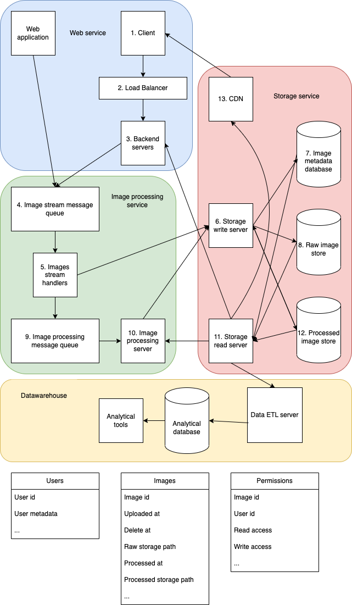

# Senior Data Enginer Tech Challenge
---
## Section3: System Design

### Design 1

We will be referencing the database from Section2 in this design.. This database will be used by several teams within the company to track the orders of members. You are required to implement a strategy for accessing this database based on the various teams' needs. These teams include:
- Logistics: 
    - Get the sales details (in particular the weight of the total items bought)
    - Update the table for completed transactions
- Analytics:
    - Perform analysis on the sales and membership status
    - Should not be able to perform updates on any tables
- Sales:
    - Update databse with new items
    - Remove old items from database

#### Solution

The ideal solution for each use case really depends on the amount of effort available.
- Logistics
  - Low effort:
    - Use views or materialised views that shows the unfulfilled order details for current day and daily aggregates
    - Allow logistics team to modify the order status in the order tables
  - High effort:
    - Use a dashboarding tool to show the unfulfulled orders, order details and daily aggregates
    - On the tool, the logistics team is able to check off completed orders which then updates the orders table
- Analytics
  - Low effort:
    - Set up read replicas of the database for the analytics to run analysis
  - High effort:
    - Set up datawarehouse using hive, spark or use cloud providers
    - Copy the data in the databases into the datawarehoue for analytical purposes
- Sales
  - Low effort:
    - In general, it is not a good idea to delete entries in a database
    - For this use case, I think a better solution is to have an is_active column for products
    - New products can be inserted into the products table
    - Old products should have their is_active field set to False
  - High effort:
    - Similar to solution for logistics team, use a dashboarding tool to allow sales team to add and remove products
    - The dashboarding tool will update the changes to the products table

### Design 2

You are designing data infrastructure on the cloud for a company whose main business is in processing images.

The company has a web application which allows users to upload images to the cloud using an API. There is also a separate web application which hosts a Kafka stream that uploads images to the same cloud environment. This Kafka stream has to be managed by the company's engineers. 

Code has already been written by the company's software engineers to process the images. This code has to be hosted on the cloud. For archival purposes, the images and its metadata has to be stored in the cloud environment for 7 days, after which it has to be purged from the environment for compliance and privacy. The cloud environment should also host a Business Intelligence resource where the company's analysts can access and perform analytical computation on the data stored.

As a technical lead of the company, you are required to produce a system architecture diagram (Visio, PowerPoint, draw.io) depicting the end-to-end flow of the aforementioned pipeline. You may use any of the cloud providers (e.g. AWS, Azure, GCP) to host the environment. The architecture should specifically address the requirements/concerns above. 

In addition, you will need to address several key points brought by stakeholders. These includes:
- Securing access to the environment and its resources as the company expands
- Security of data at rest and in transit
- Scaling to meet user demand while keeping costs low
- Maintainance of the environment and assets (including processing scripts)

You will need to ensure that the architecture takes into account the best practices of cloud computing. This includes (non-exhaustive):
- Managability
- Scalability
- Secure
- High Availability
- Elastic
- Fault Tolerant and Disaster Recovery
- Efficient
- Low Latency
- Least Privilege

Do indicate any assumptions you have made regarding the architecture. You are required to provide a detailed explanation on the diagram.

#### Solution

System architecture

Explanation is best done face-to-face, I will try my best to describe over text here.

1. Front end clients, which users interact with to upload images.
2. Clients will reach the backend servers through a load balancer. 
   This allows the backend servers to autoscale horizontally in event of high load.
3. Backend servers to handle requests from clients. 
   It will receive the images uploaded and pass to the image stream message queue.
4. The image stream message queue that uploaded images will added to to be handled later.
   This should be similar to kafka stream hosted by the other web application.
5. The iamge stream handling service will save the uploaded images and update the database through the storage write servers.
   Once the images are saved, it will pass the image metadata to the image processing message queue.
6. The storage write servers will save the images into an object store and also update the image metadata database.
7. The image metadata database will store information such as image id, user id, raw image path, uploaded time, etc.
8. The raw image store will store the raw uploaded images.
9. The image processing message queue that saved images will be processed later.
10. The image processing servers will obtain images metadata from the message queue.
    It will then download the images from the raw image store to apply the image processing code on the images.
    The processed images are then written to the processed image store through the storage write servers.
    The storage write servers will update the image metadata database accordingly.
11. The storage read service will read the images from the raw and processed image stores.
12. The processed image store will store the processed images.
13. I imagine the users will want to view the raw and processed images on the client.
    To speed up response time and minimise load on the storage, these images will be served from a CDN.

For managing data purging, this can be done in a few ways.
1. Configure suitable time-to-live in the image stores.
2. Include a delete_at field in the image metadata.
   Have a separate service to delete the image once te the time is reached.

Based on this design, each service can be scaled horizontally when ever request load is high.
This is applicable to services (3, 5, 6, 10 and 11). This ensures **elasticity** and **low latency**.

For **manageability**, each service has only a single responsibility, which allows for them to be developed independently
and be replaced completely if required. 
This also makes **efficient** resource consumption as we can allocate specific resource to each service as required.

Security can refer to different aspects. For **access security**, each service should interact with the right authentication.
Critically, the databases and image stores are not exposed directly to any service, but through storage write and read service.
Hence we can limit access by applying access control on the storage services. This also handles least privileged access.
For **data security**, the images enters the backend through message queues.
Distributed message queues are able to store messages on disk, allowing for message replays in event of downstream service failures.
This ensures data is protected from loss.

To get **high availability**, we should use multi region cloud services to ensure services stay online 
in the event of data center failures in our cloud providers.

For **fault tolerance and disaster recovery**, 
we will need to ensure that we create multi region backups of our database and image store.
This will allow us to restore the data in the unfortunate event of data loss.
Fault tolerance is also covered by the use of message queues to pass messages from one service to another.
This ensures the requests remain in the queue and can be handled later in the event of downstream service failures.
