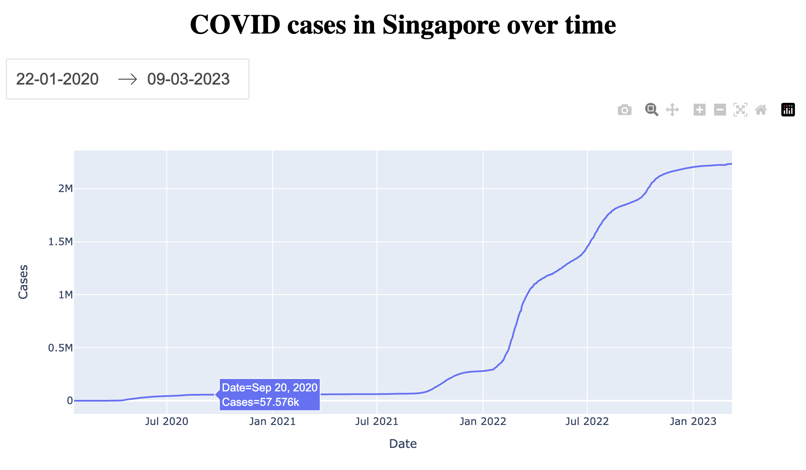

# Senior Data Enginer Tech Challenge
---
## Section 4: Charts & APIs
Your team decided to design a dashboard to display the statistic of COVID19 cases. You are tasked to display one of the components of the dashboard which is to display a visualisation representation of number of COVID19 cases in Singapore over time.

Your team decided to use the public data from https://documenter.getpostman.com/view/10808728/SzS8rjbc#b07f97ba-24f4-4ebe-ad71-97fa35f3b683.

Display a graph to show the number cases in Singapore over time using the APIs from https://covid19api.com/.

Note: please submit screenshots of the dashboard

### Instructions

Run with docker compose
```
docker compose up --build
```

Open the dashboard on your browser: http://localhost:8050



### Clean up

```
docker compose down --volumes --remove-orphans --rmi all
```
